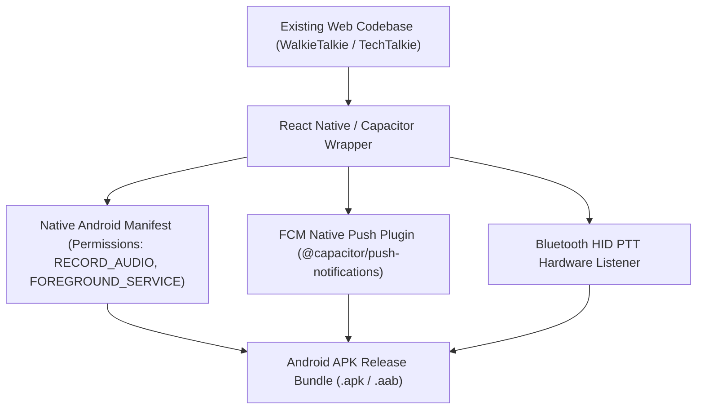

# Final Product Architectural Specification: Native Android APK & iOS App Blueprint

This document outlines the architectural blueprint for scaling our Walkie-Talkie application into a commercial **Native Mobile App (Android APK & iOS App)** using React Native / Capacitor.

---

## 📱 PWA Limits vs. Native Mobile Architecture

| Architectural Layer | Web PWA Behavior (Current) | Native Mobile App (React Native / APK) |
| :--- | :--- | :--- |
| **Background Push Notifications** | Web Push API works while tab is open/minimized, but iOS Safari & Android OS power managers kill background Service Workers when closed. | **Firebase Cloud Messaging (FCM) Native Service**: Wakes phone screen and triggers ringers even if app is completely closed or device rebooted. |
| **Bluetooth PTT Hardware Button** | Web browsers do not expose raw Bluetooth HID media key events when app is backgrounded. | **Native Android BroadcastReceiver**: Listens to hardware Bluetooth PTT mic buttons (e.g. Motorola/Zello PTT buttons). |
| **Background Voice Stream (VOX)** | Requires HTML5 `MediaSession` & `WakeLock` to stay active in browser. | **Native Android Foreground Audio Service (`RECORD_AUDIO` / `FOREGROUND_SERVICE_MICROPHONE`)**: Unkillable background audio pipeline. |

---

## 🛠️ Native App Conversion Roadmap



### Required Native Permissions (Android `AndroidManifest.xml`):
```xml
<uses-permission android:name="android.permission.RECORD_AUDIO" />
<uses-permission android:name="android.permission.MODIFY_AUDIO_SETTINGS" />
<uses-permission android:name="android.permission.INTERNET" />
<uses-permission android:name="android.permission.FOREGROUND_SERVICE" />
<uses-permission android:name="android.permission.FOREGROUND_SERVICE_MICROPHONE" />
<uses-permission android:name="android.permission.WAKE_LOCK" />
<uses-permission android:name="android.permission.BLUETOOTH_CONNECT" />
```

---

## 🎯 Commercial Features Unlocked by Native APK Build

1. 📲 **Unkillable Background Voice Call Reception**: Phone rings like a physical walkie-talkie even if battery saver is on.
2. 🎙️ **Hardware Bluetooth PTT Button Support**: Connect physical walkie-talkie Bluetooth speaker-mics (e.g., Zello PTT hardware accessories).
3. ⚡ **Zero-Latency FCM Push Dispatch**: Direct native push dispatch via FCM Admin SDK.
