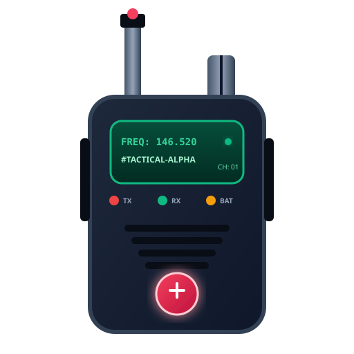

# 📻 AetherTalk - Tactical P2P Walkie Talkie PWA

[](https://r2dapps.github.io/walkietalkie/)
[](https://r2dapps.github.io/walkietalkie/)
[](LICENSE)
[](https://peerjs.com/)

**AetherTalk** is a high-performance, modular, zero-server Progressive Web App (PWA) that turns any browser or mobile device into an instant tactical walkie talkie radio over local Wi-Fi, hotspot, or internet.



---

## 🔥 Key Features

- **📻 Hardware-Style Audio DSP Filters**: Bandpass equalizer (300 Hz - 3200 Hz), dynamic compression, and voice distortion presets (*Military Tactical*, *Analog FM*, *CB Radio*, *Vintage Walkie*, *Clean*).
- **🔊 Synthesized Tactical Sound Cues**:
  - **Roger Beep**: Authentic dual-tone end-of-transmission burst on mic release.
  - **Squelch Tail**: White-noise static burst on signal end.
  - **PTT Sub-Click**: Tactile audio feedback on mic activation.
- **⚡ Multiple Peer Discovery Modes**:
  - **Instant QR Code Sharing**: Scan vector QR codes on mobile to join channels.
  - **Shareable URL Hashes**: Direct links (`#room=alpha-1&callsign=Rogue1`) for one-tap joining.
  - **Copy Invite Link & Native Share**: Web Share API integration.
- **🛡️ Tactical Radio Collision Prevention**:
  - **Channel Busy Lock**: Prevents transmission overlap if another operator is currently speaking.
  - **TX / RX LED Lights**: Real-time glowing red (TX) and green (RX) status indicators.
  - **Time-Out-Timer (TOT)**: 60-second transmission safeguard against stuck PTT buttons.
- **🎙️ Voice Activated (VOX) & PTT Shortcuts**:
  - Hold **Push-To-Talk (PTT)** button or hold **Spacebar** on keyboard.
  - Optional **VOX (Voice Activity Detection)** threshold mode.
  - Haptic vibration feedback on mobile devices.
- **💬 Encrypted Tactical DataChannel Chat**:
  - P2P text log with timestamps and callsign tags.
  - Built-in **NATO Phonetic Alphabet** quick-reference helper (Alpha -> Zulu).
- **📊 WebRTC Diagnostics Panel**:
  - Live latency RTT (ms), ICE connection states, Opus codec monitoring, packet counters, and AudioContext state.
- **📲 Full PWA Support**:
  - Offline Service Worker asset caching (`sw.js`).
  - Home screen installation prompt (`manifest.json`).

---

## 🛠️ Architecture Overview

```
walkietalkie/
├── index.html                   # HTML5 Tactical Layout & SEO Metadata
├── manifest.json                # PWA Manifest
├── sw.js                        # Offline Caching Service Worker
├── css/
│   └── styles.css               # Tactical Dark OLED Theme & Glow LEDs
├── js/
│   ├── app.js                   # Main Lifecycle Orchestrator
│   ├── audio.js                 # Web Audio DSP (Bandpass, Distortion, Roger Beep, Squelch)
│   ├── peer.js                  # WebRTC Mesh (PeerJS, DataChannels, Channel Locking, TOT)
│   ├── ui.js                    # UI Controller, Modals, Presets, NATO Helper, Diagnostics
│   ├── visualizer.js            # Battery-Optimized Canvas Waveform Ring
│   ├── pwa.js                   # Service Worker & PWA Installation Manager
│   ├── share.js                 # Pure-JS QR Generator & URL Hash Parser
│   └── storage.js               # LocalStorage Persistence Engine
├── assets/
│   └── icon.svg                 # Vector Walkie Talkie Graphic Asset
└── legacy/                      # Archived Original Files
```

---

## 🌐 Deploying to GitHub Pages

1. Push your changes to the `main` branch of your GitHub repository.
2. In GitHub, navigate to **Settings** -> **Pages**.
3. Under **Build and deployment**:
   - **Source**: Select `Deploy from a branch`
   - **Branch**: Choose `main` branch and `/ (root)` directory.
4. Save settings. GitHub Pages will build and publish your site automatically at:
   `https://<your-username>.github.io/walkietalkie/`

---

## 🚀 Local Development

To run AetherTalk locally, serve the repository root with any HTTP static file server (HTTPS or localhost is required for WebRTC microphone access):

```bash
# Using Python
python3 -m http.server 8000

# Using Node.js npx http-server
npx http-server -p 8000
```

Open `http://localhost:8000` in your browser.

---

## 📖 Usage Guide

1. **Enter Frequency Channel**: Select a preset channel (e.g. `⭐ Alpha-1`) or type a custom channel name.
2. **Enter Call Sign**: Set your tactical nickname (e.g. `Operator-X`).
3. **Establish Frequency**: Tap **Establish Frequency** and allow microphone access.
4. **Push-To-Talk**: Press and hold the **Push To Talk** button or hold **Spacebar** to broadcast.
5. **Release to Listen**: Releasing the button triggers the **Roger Beep** and squelch noise tail.

---

## 📄 License

Distributed under the MIT License. See `LICENSE` for details.
